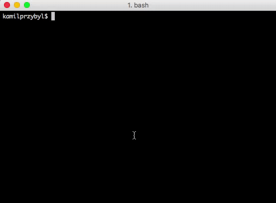

# Minishell

The objective of this project is to create a simple shell.

<br />



## General

&ensp; It's a simplistic version of shell:

- It shows a prompt when waiting for a new command

- It contains recoded builtin functions as follows
   - `echo`
   - `cd`
   - `pwd`
   - `export`
   - `unset`
   - `env`
   - `exit`

- It search and launch the right executable (based on the PATH variable)

- Supports `;` seperated list of commands

<br />

## Setup

```
$ git clone git@github.com:kamilprzybyl/minishell.git
$ cd minishell
$ make
$ ./minishell
```

